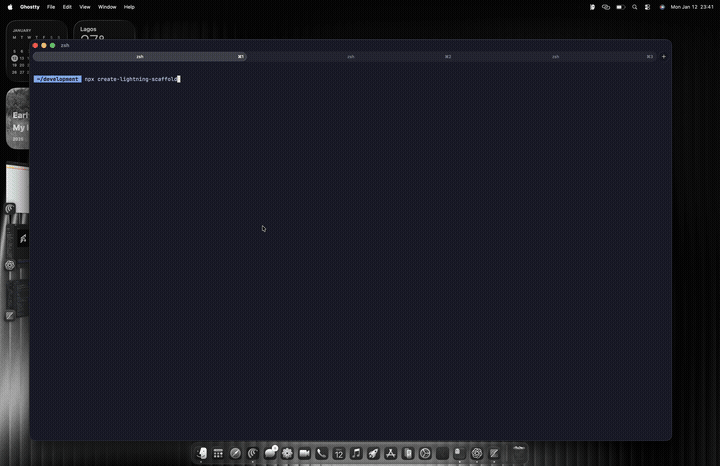

# create-lightning-scaffold




> ⚡ **5 minutes from `npx` to first gasless transaction**

CLI to scaffold Solana apps with LazorKit SDK. Generate React Native (Expo) or Next.js projects with passkey authentication, gasless transactions, and a ready-to-use swap interface.

## 🚀 Live Demos

**Web Demo:** [Try it live on Devnet →](https://lighting-demo.vercel.app)

**Mobile Demo:** [Download APK](./mobile-demo) or run locally with Expo Go

Experience passkey authentication and gasless transactions on web and mobile.

## Quick Start

```bash
npx create-lightning-scaffold
```

## What You Get

Every generated project includes:

- **Passkey Onboarding** - Create wallets with Face ID/Touch ID, no seed phrases
- **Token Swap UI** - Real swap interface powered by Jupiter aggregator (SOL ↔ USDC)
- **Balance Display** - Real-time token balances with Max button
- **Transaction History** - View past transactions with Solscan links
- **Recovery & Backup** - Add backup passkeys from other devices
- **Message Signing** - Verify wallet ownership with `signMessage`
- **Gasless Transactions** - Users don't pay gas fees (paymaster sponsored)
- **Smart Wallets** - LazorKit PDA-based accounts with recovery options

## Features

- 🚀 **5 Presets**: Mobile App, Web App, Full-Stack Mobile, Full-Stack Web, Monorepo
- 🔐 **LazorKit SDK**: Official `@lazorkit/wallet` (web) and `@lazorkit/wallet-mobile-adapter` (mobile)
- 🔄 **Jupiter Integration**: Real-time quotes and swaps via Jupiter aggregator API
- 📱 **React Native + Expo**: Native passkey support with `expo-web-browser`
- 🌐 **Next.js + Vite**: Both frameworks supported with proper polyfills
- 🎨 **Styling**: TailwindCSS or pure CSS/StyleSheet (your choice)
- 📦 **State**: Zustand or Redux Toolkit
- 🗄️ **Backend**: Supabase, Firebase, or NestJS integration

## Usage

```bash
# Interactive mode
npx create-lightning-scaffold

# You'll be prompted for:
# - Project name
# - Preset (Mobile, Web, Full-Stack, Monorepo)
# - Web framework (Next.js or Vite)
# - Styling preference (tailwind or none)
# - State management
# - Package manager
```

## Presets

| Preset | Description | SDK |
|--------|-------------|-----|
| Mobile App | React Native + Expo | `@lazorkit/wallet-mobile-adapter` |
| Web App | Next.js or Vite | `@lazorkit/wallet` |
| Full-Stack Mobile | React Native + Backend | `@lazorkit/wallet-mobile-adapter` |
| Full-Stack Web | Next.js/Vite + Backend | `@lazorkit/wallet` |
| Monorepo | Mobile + Web + Backend | Both |

## Configuration

After scaffolding, copy `.env.example` to `.env`:

```bash
cp .env.example .env
```

Default config uses Devnet. For production, get your API key from [portal.lazor.sh](https://portal.lazor.sh).

## SDK Integration

### Web (Next.js / Vite)

Uses `@lazorkit/wallet` with `LazorkitProvider`:

```tsx
import { LazorkitProvider, useWallet } from '@lazorkit/wallet';

// Provider setup
<LazorkitProvider
  rpcUrl="https://api.devnet.solana.com"
  portalUrl="https://portal.lazor.sh"
  paymasterConfig={{ paymasterUrl: "https://kora.devnet.lazorkit.com" }}
>
  {children}
</LazorkitProvider>

// In components
const { connect, disconnect, signAndSendTransaction, signMessage, wallet } = useWallet();

// Connect with passkey
await connect();

// Sign a message
const { signature } = await signMessage("Verify ownership");

// Send gasless transaction
const sig = await signAndSendTransaction({
  instructions: [instruction],
  transactionOptions: { feeToken: 'USDC' }
});
```

### Mobile (Expo)

Uses `@lazorkit/wallet-mobile-adapter` with `LazorKitProvider`:

```tsx
import { LazorKitProvider, useWallet } from '@lazorkit/wallet-mobile-adapter';

// Provider setup
<LazorKitProvider
  rpcUrl="https://api.devnet.solana.com"
  portalUrl="https://portal.lazor.sh"
  configPaymaster={{ paymasterUrl: "https://kora.devnet.lazorkit.com" }}
>
  {children}
</LazorKitProvider>

// In components - requires redirectUrl for mobile
const { connect, signAndSendTransaction, signMessage, wallet } = useWallet();

await connect({ redirectUrl: 'myapp://callback' });
await signMessage("Hello", { redirectUrl: 'myapp://callback' });
```

## Jupiter Swap Integration

The generated swap UI uses Jupiter's aggregator API for real-time quotes:

```tsx
// Get quote
const quote = await fetch(
  `https://api.jup.ag/swap/v1/quote?inputMint=${SOL}&outputMint=${USDC}&amount=${amount}&slippageBps=50`
).then(r => r.json());

// Build swap transaction
const { swapTransaction } = await fetch('https://api.jup.ag/swap/v1/swap', {
  method: 'POST',
  body: JSON.stringify({ quoteResponse: quote, userPublicKey: wallet })
}).then(r => r.json());
```

## Architecture

```
┌─────────────┐     ┌──────────────────┐     ┌─────────────────┐
│   User      │────▶│  LazorKit Portal │────▶│  Smart Wallet   │
│  (Passkey)  │     │  (Auth + Keys)   │     │  (PDA on-chain) │
└─────────────┘     └──────────────────┘     └─────────────────┘
                            │
                            ▼
                    ┌──────────────────┐
                    │    Paymaster     │
                    │  (Pays gas fees) │
                    └──────────────────┘
```

## Troubleshooting

| Issue | Solution |
|-------|----------|
| Passkey not working | Ensure HTTPS (localhost OK for dev), check browser supports WebAuthn |
| Transaction failing | Verify wallet has balance, check RPC endpoint, confirm paymaster config |
| Mobile redirect issues | Ensure deep link scheme matches `app.json` config |

## More Resources

- **[SNIPPETS.md](./SNIPPETS.md)** - Copy-paste code examples
- **[TUTORIALS.md](./TUTORIALS.md)** - Step-by-step integration guides
- **[Twitter Thread](https://x.com/Tobi_Builder/status/2011043242251293087)** - Passkey wallet tutorial

## License

MIT
